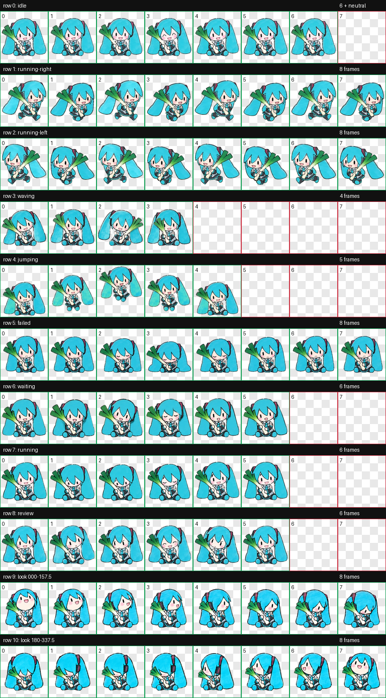

# Hand-drawn Miku Codex Pet

An unofficial, free, non-commercial Hatsune Miku animated pet for Codex desktop. This soft hand-drawn edition brings notebook-like lines and watercolor warmth to your coding workspace.



## Features

- Codex Pet v2 atlas: 1536×2288 transparent WebP, 8×11 grid
- Nine animation states: idle, run right, run left, wave, jump, failed, waiting, running, and review
- Sixteen continuous look directions
- Frame-by-frame QA for stable scale, baseline, padding, and motion
- Local-only asset with no telemetry or access to your code or conversations
- Install scripts for macOS/Linux and Windows

## Install

Download the ZIP from the [latest release](https://github.com/tjh-TJ/miku-handdrawn-codex-pet/releases/latest), extract it, then run:

```bash
chmod +x install.sh
./install.sh
```

On Windows PowerShell:

```powershell
powershell -ExecutionPolicy Bypass -File .\install.ps1
```

Open **Codex Settings → Pets**, choose **Refresh**, then select **手绘 Miku**. For manual installation, copy `pet/miku-handdrawn` to `~/.codex/pets/miku-handdrawn` on macOS/Linux or `%USERPROFILE%\.codex\pets\miku-handdrawn` on Windows.

If this pet makes your workspace a little warmer, please leave a ⭐. Stars help other Codex users discover the project.

## Legal notice

This is an unofficial fan work and is not affiliated with, sponsored by, or endorsed by Crypton Future Media, Inc. or OpenAI. Hatsune Miku / 初音ミク © Crypton Future Media, Inc. See [ASSET-LICENSE.md](ASSET-LICENSE.md) and the [Piapro Character Guideline](https://piapro.jp/license/character_guideline). The MIT License covers the installer scripts and documentation only, not the character artwork or sprites.
